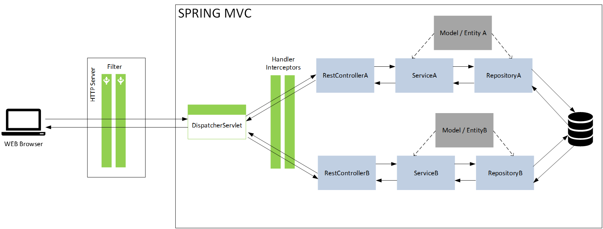

# Comprendre le traitement des requètes par Spring

## 1 Fonctionnement

Lors de configuration d'applications Web Spring va créer un object uniquement qui va redispatcher les requètes Http reçu.
Cet objet est le `DispatcherServlet`.
Deux autres utilitaires existent permettant de traiter les informations provenant de l'extérieur:
- `Filter` : utilisé pour manipuler **toutes** les requêtes en amont du `Dispatcher`
- `HandlerInterceptors` :intercèpte les requêtes entre le  `DispatcherServlet` et les `Controller` ou `RestController`de Spring. Ces objets servent en général pour des traitements plus fin des requêtes (e.g vérification détaillée des autorisation, logs, ...).




## 2 Mise en oeuvre 

### 2.1 Mise en oeuvre d'un Filtre

- Créer un nouveau package `com.security.app.core`.
- Créer un autre package `com.security.app.core.filter`.
- A l'intérieur de ce package créer le fichier `LogFilter.java`comme suit:

    ```java
    package com.security.app.core.filter;

    import ...

    @Component
    public class LogFilter implements Filter {

        private Logger logger = LoggerFactory.getLogger(LogFilter.class);

        @Override
        public void doFilter(ServletRequest request, ServletResponse response, FilterChain chain) 
          throws IOException, ServletException {
        	String given_url="";
        	if( request instanceof HttpServletRequest) {
        		given_url = ((HttpServletRequest)request).getRequestURI();
        	}
        	logger.info("Hello from: " + request.getLocalAddr()+" url asked:"+given_url);

        	System.out.println("I AM the Filter!");
            chain.doFilter(request, response);
        }

    }
    ```
- Explications:
  - `@Component` permet à Spring de détecter le Bean créer
  ```java
    ...
    public class LogFilter implements Filter {
    ...
  ```
  - Surchage la Classe Filter permettant de définir un traitement sur les requêtes entrantes

  ```java
    ...
    private Logger logger = LoggerFactory.getLogger(LogFilter.class);
    ...
  ```
  - Crée un utilitaire de log (Log4j) pour la classe en cours

  ```java
      ...
        @Override
      public void doFilter(ServletRequest request, ServletResponse response, FilterChain chain) 
        throws IOException, ServletException {
      ...
  ```
  - Méthode permettant de récupérer la requête entrante `ServletRequest` ou sortante `ServletResponse` ainsi que le prochain filtre de la chaine des filters à retranmettre la requête traitée `FilterChain`
  ```java
      ...
      chain.doFilter(request, response);
      ...
  ```
  - Retransmet les éléments au prochain étage de traitement 

- Démarrer votre serveur et appeler l'url `/hero`, le résultat suivant devrait apparaitre sur la console du server:
  ```
    2023-02-14 12:25:56.928  INFO 17872 --- [0.1-8081-exec-1] o.a.c.c.C.[Tomcat].[localhost].[/]       : Initializing Spring DispatcherServlet 'dispatcherServlet'
    2023-02-14 12:25:56.929  INFO 17872 --- [0.1-8081-exec-1] o.s.web.servlet.DispatcherServlet        : Initializing Servlet 'dispatcherServlet'
    2023-02-14 12:25:56.929  INFO 17872 --- [0.1-8081-exec-1] o.s.web.servlet.DispatcherServlet        : Completed initialization in 0 ms
    2023-02-14 12:25:56.938  INFO 17872 --- [0.1-8081-exec-1] com.security.app.core.filter.LogFilter   : Hello from: 127.0.0.1 url asked:/hero
    I AM the Filter!
    2023-02-14 12:25:56.955  INFO 17872 --- [0.1-8081-exec-1] com.security.app.hero.rest.HeroRestCrt   : In the Rest Controller!

  ```


  ### 2.1 Mise en oeuvre d'un Interceptor
  - Créer le package `hinterceptor` dans `com.security.app.core`.
  - Créer le fichier `LogInterceptor.java` comme suit dans ce package:

    ```java
    package com.security.app.core.hinterceptor;
    import ...
    @Component
    public class LogInterceptor implements HandlerInterceptor {
    
    	Logger log = org.slf4j.LoggerFactory.getLogger(this.getClass());
    
    	@Override
    	// Before data is transmitted back
    	// This is used to perform operations after completing the request and response.
    	public void afterCompletion(HttpServletRequest request, HttpServletResponse response, Object object, Exception arg3)
    			throws Exception {
    		log.info("Request is complete");
    	}
    
    	@Override
    	// After task before the interceptor action
    	// This is used to perform operations before sending the response to the client.
    	public void postHandle(HttpServletRequest request, HttpServletResponse response, Object object, ModelAndView model)
    			throws Exception {
    		log.info("Handler execution is complete");
    	}
    
    	@Override
    	// Execute task before the interceptor action
    	// This is used to perform operations before sending the request to the
    	// controller. This method should return true to return the response to the
    	// client.
    	public boolean preHandle(HttpServletRequest request, HttpServletResponse response, Object object) throws Exception {
    		log.info("Before Handler execution");
    		String authHeaderValue = request.getHeader("Authorization");
    		if (authHeaderValue != null) {
    			log.info("Auth Value: "+authHeaderValue);
    			if (authHedaerValue.contains("EXIT")) {
    				return false;
    			}
    		}
    		return true;
    	}
    
    }

    ```

    - Explications:
      - `@Component`permet à Spring de détecter le Bean créer
    ```java
        ...
        public class LogInterceptor implements HandlerInterceptor { 
        ...
    ```
      - Implements les méthodes de `HandlerInterceptor` à savoir :
        - `afterCompletion` : Se lance à la toute fin des opérations de l'interceptor
        - `postHandle`: se lance après le retour du controlleur
        - `preHandle`: se lance avant d'envoyer les informations aux controlleurs

- Afin que notre intercepteur soit pris en compte il faut mettre à jour la configuration Web de notre application.

- Dans le package `com.security.app.core` créer le fichier WebConfig.java comme suit:
  ```java
    package com.security.app.core;

    import ...

    @Configuration
    public class WebConfig implements WebMvcConfigurer {

    	@Autowired
    	LogInterceptor logInterceptor;

    	@Override
    	public void addInterceptors(InterceptorRegistry registry) {
    		registry.addInterceptor(logInterceptor);
    	}
    }
  ```  
- Explications
  -  `@Configuration` informe Spring que des éléments de configuration et des Bean sont présents dans ce fichier et qu'il devra les charger au démarrage.

  ```java
    ...
    public class WebConfig implements WebMvcConfigurer {
    ...
  ```
  - Permet de surcharger la configuration Web de l'application

  ```java
    	@Autowired
    	LogInterceptor logInterceptor;
  ```
  - Injecte notre Interceptor dans la classe courante (injection possible car la classe `LogInterceptor` présente l'annotation `@Component`et est concidéré comme un bean)
  ```java
    @Override
      	public void addInterceptors(InterceptorRegistry registry) {
      		registry.addInterceptor(logInterceptor);
      	}
  ```
  - Ajoute notre interceptor à la liste des interceptors de l'application


- Démarrer votre serveur et appeler l'url `/hero`, le résultat suivant devrait apparaitre sur la console du server:
  ```
    2023-02-14 12:34:15.017  INFO 18644 --- [0.1-8081-exec-1] o.a.c.c.C.[Tomcat].[localhost].[/]       : Initializing Spring DispatcherServlet 'dispatcherServlet'
    2023-02-14 12:34:15.017  INFO 18644 --- [0.1-8081-exec-1] o.s.web.servlet.DispatcherServlet        : Initializing Servlet 'dispatcherServlet'
    2023-02-14 12:34:15.018  INFO 18644 --- [0.1-8081-exec-1] o.s.web.servlet.DispatcherServlet        : Completed initialization in 1 ms
    2023-02-14 12:34:15.028  INFO 18644 --- [0.1-8081-exec-1] com.security.app.core.filter.LogFilter   : Hello from: 127.0.0.1 url asked:/hero
    I AM the Filter!
    2023-02-14 12:34:15.036  INFO 18644 --- [0.1-8081-exec-1] c.s.a.core.hinterceptor.LogInterceptor   : Before Handler execution
    2023-02-14 12:34:15.046  INFO 18644 --- [0.1-8081-exec-1] com.security.app.hero.rest.HeroRestCrt   : In the Rest Controller!
    2023-02-14 12:34:15.220  INFO 18644 --- [0.1-8081-exec-1] c.s.a.core.hinterceptor.LogInterceptor   : Handler execution is complete
    2023-02-14 12:34:15.221  INFO 18644 --- [0.1-8081-exec-1] c.s.a.core.hinterceptor.LogInterceptor   : Request is complete
  ```