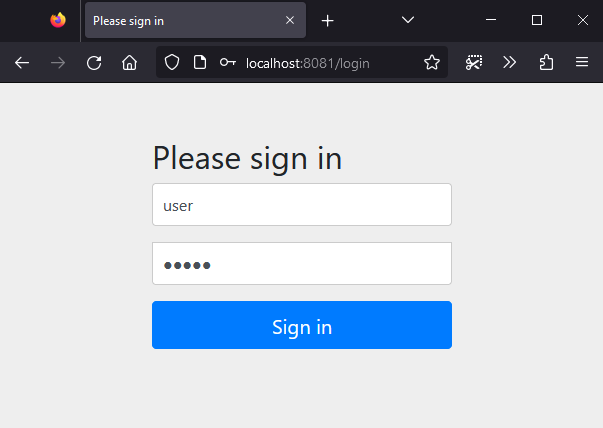
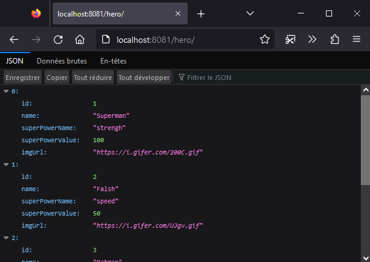

# Mise en place d'une première configuration Spring Security

## 1 Contexte de l'application
- Récupérer le contenu de [step0](../step0)
- Ici nous avons une application qui permet d'afficher et d'ajouter des "Hero"s
  - **HeroService**: en charge de la logique métier
  - **HeroRepository**: nous permet de faire le lien avec la base de données
  - **Hero**: modèle de notre Objet
  - **HeroRestCrt**: rest controller qui va définir les points d'entrées (URL) pour interagir avec les **Hero**

## 2 Récupération des dépendances

- Afin de pouvoir utiliser Springboot Security, la dépendance du package doit être ajoutée au fichier ```pom.xml```.

```xml
...
<dependencies>
    ...
    <dependency>
                <groupId>org.springframework.boot</groupId>
                <artifactId>spring-boot-starter-security</artifactId>
    </dependency>
    ...
</dependencies>
...

```

## 3 Création d'une première configuration
- Créer le package `com.security.app.config.security`
- Dans ce package créer le fichier suivant `SecurityConfig.java` comme suit:


```java
package com.security.app.config.security;

import ...
@Configuration
@EnableWebSecurity
public class SecurityConfig {
	
	@Bean
	public SecurityFilterChain filterChain(HttpSecurity http) throws Exception {
 		http.csrf(csrf->csrf.disable());
        http
            .authorizeHttpRequests(auth -> auth.requestMatchers("/login").permitAll())
            .formLogin(withDefaults())
            .authorizeHttpRequests(auth ->
                        auth.requestMatchers("/hero/**").authenticated()
                            .anyRequest().permitAll())
            .logout(logout-> logout.logoutUrl("/logout").permitAll().invalidateHttpSession(true));
	    return http.build();
	}
```
- Explications
  - `@EnableWebSecurity` : active le support de Spring Web Security et fournit une integration à Spring MVC
  - `@Bean`: définie la méthode comme un Bean et sera appelée lors du démarrage de l'application
 ```java
    ...
	@Bean
	public SecurityFilterChain filterChain(HttpSecurity http) throws Exception {
    ...
 ```
 - Ajouter un filtre de sécurité dans la chaine des Filtres de l'application
 - `http.csrf(csrf->csrf.disable());` : Désactive la sécurité Cross-Site Request Forgery (CSRF) afin de permettre des appels de login sans valeurs cachées csfr (pour plus d'information.  [https://www.baeldung.com/spring-security-csrf](https://www.baeldung.com/spring-security-csrf))
 - ` .authorizeHttpRequests(auth ->auth.requestMatchers("/hero/**").authenticated()...)`: permet de définir des règles de filtrage. La méhode `.requestMatchers()` permet de spécifier l'ensemble des URls impactées par l'action qui suit (ici `.authenticated()`).
 - `permitAll()`, `.authenticated()`: définit le type d'action sur une URL.
 - `.formLogin(withDefaults())`: générer automatique un formulaire pour se logger
 - `.anyRequest().permitAll();`: applique une action sur l'ensemble de requêtes, en production doit être positionné à .`authenticated()`.

## 4 Test de la configuration
- Compiler et démarrer votre application
- Ouvrer un Web Browser et aller à l'URL suivant `http://localhost:8081/hero`
- N'étant pas authentifier vous êtes redirigé automatique sur le formulaire de login de l'application.



- Regarder les logs de l'application un utilisateur a été automatique généré:

```  
...
Using generated security password: 40bb7391-06d3-4a42-a325-cc3c8b06d671

This generated password is for development use only. Your security configuration must be updated before running your application in production.
..
2023-02-14 14:50:41.489  INFO 18384 --- [           main] o.s.b.w.embedded.tomcat.TomcatWebServer  : Tomcat started on port(s): 8081 (http) with context path ''
2023-02-14 14:50:41.498  INFO 18384 --- [           main] com.security.app.HeroApp                 : Started HeroApp in 4.183 seconds (JVM running for 4.61)
``` 

- Loggez-vous à l'aide de l'utisateur par défaut et de son mot de passe (login par défaut = `user`.
- Une fois loggé vous pouvez accéder à l'url demandée

