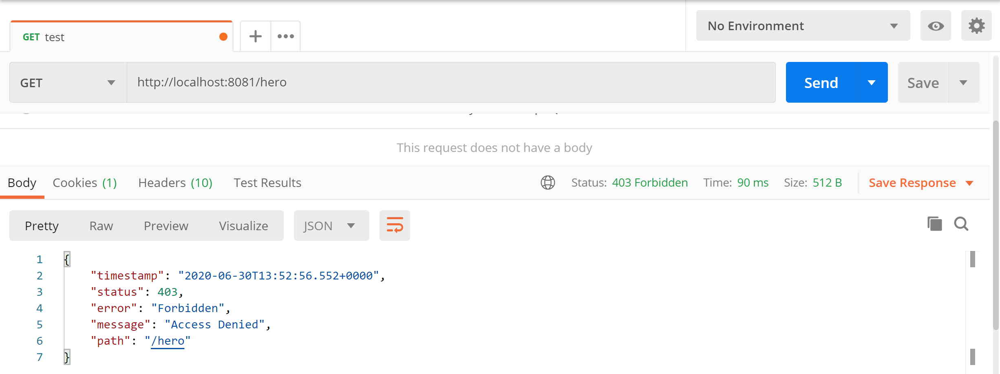
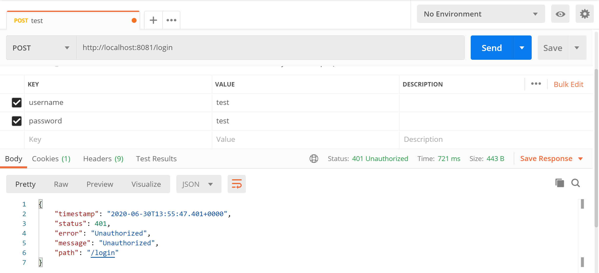
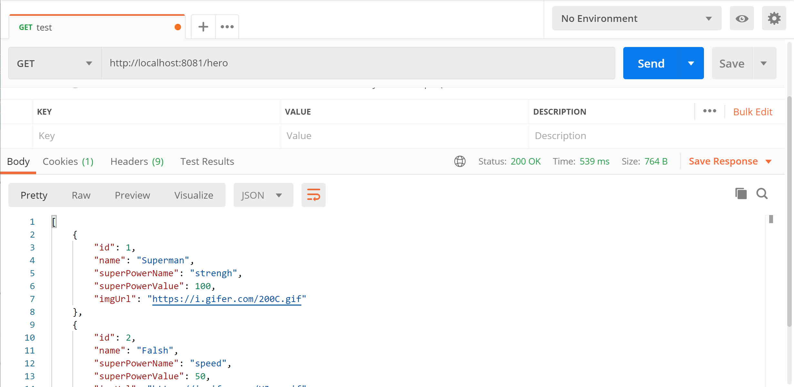

# Mise en place d'une authentification simple via Springboot security
## 1.  Contexte de l'application
- Récupérer le contenu de [step0](../step0)
- Ici nous avons une application qui permet d'afficher et d'ajouter des "Hero"s
  - **HeroService**: en charge de la logique métier
  - **HeroRepository**: nous permet de faire le lien avec la base de données
  - **Hero**: modèle de notre Objet
  - **HeroRestCrt**: rest controller qui va définir les points d'entrées (URL) pour interagir avec les **Hero**

## 2. Authentification d'un utilisateur
- Dans cette section nous allons ajouter l'authentification simple d'un utilisateur à l'aide de [SpringBoot Security](https://spring.io/guides/topicals/spring-security-architecture/)

- Afin de pouvoir utiliser Springboot Security, la dépendance du package doit être ajoutée au fichier ```pom.xml```.

```xml
...
<dependencies>
    ...
    <dependency>
                <groupId>org.springframework.boot</groupId>
                <artifactId>spring-boot-starter-security</artifactId>
    </dependency>
    ...
</dependencies>
...

```

### 2.1  Modèle User
- Créer le package suivant ```com.security.app.auth.model ```
- Créer le fichier  ```User.java``` comme suit:

```java
package com.security.app.auth.model;

import ...

@Entity
@Table(name = "APPUSER")

// Extends UserDetails to be checked by authentication
public class User implements Serializable , UserDetails {
    @Id
    @GeneratedValue(strategy = GenerationType.IDENTITY)
    private Integer userId;
    private String username;
    private String password;
    public Integer getUserId() {
        return userId;
    }
    public void setUserId(Integer userId) {
        this.userId = userId;
    }
    public String getUsername() {
        return username;
    }
    @Override
    public boolean isAccountNonExpired() {
        return false;
    }
    @Override
    public boolean isAccountNonLocked() {
        return false;
    }
    @Override
    public boolean isCredentialsNonExpired() {
        return false;
    }
    @Override
    public boolean isEnabled() {
        return false;
    }
    public void setUsername(String username) {
        this.username = username;
    }
    @Override
    public Collection<? extends GrantedAuthority> getAuthorities() {
        return null;
    }
    public String getPassword() {
        return password;
    }
    public void setPassword(String password) {
        this.password = password;
    }
}
```
- Explications
    ```java 
    ...
    public class User implements Serializable , UserDetails {
    ...
    ```
    - ```UserDetails```: permet de pouvoir utiliser correctement SpringBoot Security, notamment pour l'authentification

### 2.2  User Repository
Le ```User Repository``` va nous permettre de faire le lien entre la base de données et les modèles ```User```
- Créer le package suivant ```com.security.app.auth.controller ```
- Créer le fichier ```UserRepository.java``` comme suit:


```java
package com.security.app.auth.controller;

import ...

public interface UserRepository extends CrudRepository<User, Integer> {
    Optional<User>  findUserByUsername(String username);
}
```

### 2.3 Création d'un utilisateur par défault 
Afin de tester notre authentification nous aurons besoin d'utilisateurs existant dans la base de données.
Pour cela, le fichier ```data.sql``` présent dans ```src.main.resources``` va être exécuté par défault une fois le serveur Springboot démarré.

- Modifier le fichier ```data.sql``` comme suit:

```sql
...
INSERT INTO APPUSER(username, password) VALUES('admin', 'pwdadmin')
...
```

### 2.4 Auth Service
Le User service va permettre de réaliser la logique métier.
- Dans le package ```com.security.app.auth.controller ```, créer le fichier ```AuthService.java``` comme suit:

```java
package com.security.app.auth.controller;

import ...

@Service
public class AuthService implements UserDetailsService {
	@Autowired
	UserRepository userRepository;
	
    @Override
    public UserDetails loadUserByUsername(String username) throws UsernameNotFoundException {
        Objects.requireNonNull(username);
        User user = userRepository.findUserByUsername(username)
                .orElseThrow(() -> new UsernameNotFoundException("User not found"));
        return user;
    }
}
```

- Explications
    ```java
    ...
    public class UserService implements UserDetailsService {
    ...
    ```
    - la classe UserService implémente le contrat ```UserDetailsService``` qui sera nécessaire lors de l'authentification (notamment lors de l'usage de ```DaoAuthenticationProvider``` pour récupérer l'authentification ). 


### 2.5 Contrôleur d'authentification
Dans Springboot security, plusieurs contrôleurs d'authentification existent par default. Ici nous allons créer notre propre contrôleur d'authentification afin de pouvoir le modifier par la suite.

- Dans le package ```com.security.app.auth.controller ```, créer le fichier ```AppAuthProvider.java``` comme suit:


```java
package com.security.app.auth.controller;

import ...

public class AppAuthProvider extends DaoAuthenticationProvider {
    public AppAuthProvider(UserDetailsService userDetailsService) {
        super(userDetailsService);
    }    
    @Override
    public Authentication authenticate(Authentication authentication) throws AuthenticationException {
        UsernamePasswordAuthenticationToken auth = (UsernamePasswordAuthenticationToken) authentication;
        String name = auth.getName();
        String password = auth.getCredentials()
                .toString();
        UserDetails user = this.getUserDetailsService().loadUserByUsername(name);
        if (user == null) {
            throw new BadCredentialsException("Username/Password does not match for " + auth.getPrincipal());
            
        }else if(! user.getPassword().equals(password)) {
        	   throw new BadCredentialsException("Username/Password does not match for " + auth.getPrincipal());
        }
        return new UsernamePasswordAuthenticationToken(user, null, user.getAuthorities());
    }
    
    @Override
    public boolean supports(Class<?> authentication) {
        return authentication.equals(UsernamePasswordAuthenticationToken.class);
    }
}
```
- Explications

    ```java
        ...
        public class AppAuthProvider extends DaoAuthenticationProvider {
        ...
    ```
    - Afin de créer notre propre Authentication Provider nous allons étendre un provider existant. En Springboot plusieurs ```AuthenticationProvider``` existent (Dao, Ldap, OpenId,...). Ici nous allons étendre le ```DaoAuthenticationProvider``` qui nous permet de récupérer les données depuis notre base de données.

    ```java
    ...
    @Override
    public Authentication authenticate(Authentication authentication) throws AuthenticationException {
    ...
    ```
    - Cette méthode sera déclenchée lors d'une demande d'authentification. Le login et le pwd de demande d'authentification seront disponibles dans l'objet ```Authentication```.

    ```java
    ...
    UsernamePasswordAuthenticationToken auth = (UsernamePasswordAuthenticationToken) authentication;
    ...
    ```
    - ```UsernamePasswordAuthenticationToke``` est une implémentation simple de ```Authentication``` qui permet une représentation simple du login et pwd d'un utilisateur. 


    ```java
    ...
    return new UsernamePasswordAuthenticationToken(user, null, user.getAuthorities());
    ...
    ```
    - En cas de succès, retourne l'objet complet User trouvé dans la base de données.

    ```java
    ...
    @Override
    public boolean supports(Class<?> authentication) {
        return authentication.equals(UsernamePasswordAuthenticationToken.class);
    }
    ...
    ```
    - Permet de vérifier si l'authentification courante (format) est compatible avec l'AuthenticationProvider courant. Si ce n'est pas le cas, un autre AuthenticationProvider peut être potentiellement appelé (ce n'est pas le cas dans notre exemple)


### 2.6 Configuration de la sécurité Springboot
Dans cette section nous allons configurer la sécurité Web de notre application. Les différents URL accessibles directement ou nécessitant une authentification seront définies dans cette configuration. C'est également ici ou nous allons définir notre ```AppAuthProvider``` comme système d'authentification par défault.
- Créer le package ``` com.security.app.config.security```
- Dans ce package créer le fichier ```SecurityConfig.java``` comme suit:

```java
package com.security.app.config.security;

import ...

@Configuration
@EnableWebSecurity
public class SecurityConfig {
	private final AuthService authService;

	public SecurityConfig(AuthService authService) {
		this.authService = authService;
	}

	@Bean
	AuthenticationManager authenticationManager(AuthenticationConfiguration authConfiguration) throws Exception {
		return authConfiguration.getAuthenticationManager();
	}

	@Bean
	public SecurityFilterChain filterChain(HttpSecurity http) throws Exception {
		
		//use to allow direct login call without hidden value csfr (Cross Site Request Forgery) needed
		http.csrf().disable();
		http.csrf(csrf->csrf.disable());
		http.authenticationProvider(getProvider());
		http.authorizeHttpRequests(auth->
						auth.requestMatchers("/hero/**").authenticated()
								.anyRequest().permitAll());
		http.formLogin(form-> form.loginProcessingUrl("/login")
						.permitAll())
				.logout(logout->logout.logoutUrl("/logout")
						.permitAll()
						.invalidateHttpSession(true));
		return http.build();
	}

	@Bean
	public AuthenticationProvider getProvider() {
		AppAuthProvider provider = new AppAuthProvider(authService);
		return provider;
	}
}

```
- Explications
    ```java
    ...
        @Configuration
        @EnableWebSecurity
        public class SecurityConfig {
    ...
    ```
    
    - ```@EnableWebSecurity```: précise que la configuration WebSecurity sera précisée dans cette classe
    
    ```java
        private final AuthService authService;

	    public SecurityConfig(AuthService authService) {
		    this.authService = authService;
	    }
    ```
    - Permet d'injecter notre service d'authentification préalablement créé

    ```java
    @Bean
	AuthenticationManager authenticationManager(AuthenticationConfiguration authConfiguration) throws Exception {
		return authConfiguration.getAuthenticationManager();
	}
    ```
    - Permet de créer un authentication Manager par défault 

    ```java
   @Bean
	public SecurityFilterChain filterChain(HttpSecurity http) throws Exception {
		
		//use to allow direct login call without hidden value csfr (Cross Site Request Forgery) needed
		http.csrf(csrf->csrf.disable());
		http.authenticationProvider(getProvider());
		http.authorizeHttpRequests(auth->
						auth.requestMatchers("/hero/**").authenticated()
								.anyRequest().permitAll());
		http.formLogin(form-> form.loginProcessingUrl("/login")
						.permitAll())
				.logout(logout->logout.logoutUrl("/logout")
						.permitAll()
						.invalidateHttpSession(true));
	
		return http.build();
	}
    ```
    - ```http.csrf(csrf->csrf.disable()); ```: permet de désactiver la sécurité ```Cross Site Request Forgery```. Si cette sécurité est activée un attribut généré par le serveur supplémentaire est nécessaire (csfr) lors de l'envoi de la requête de login. En désactivant cette sécurité nous pouvons tester directement notre login via PostMan.
    - ```http.authenticationProvider(getProvider())```: permet de spécifier quel AuthenticationProvider nous allons utiliser dans notre application (ici ```AppAuthProvider``` fournit par la méthode ```getProvider()```)
    - ```http.formLogin(form-> form.loginProcessingUrl("/login").permitAll())...```: permet de définir le comportement de login de notre application. Ici l'authentification sera accessible sur l'url **"/login"** (```.loginProcessingUrl("/login")```), elle sera accessible à tous (```.permitAll()```) 
    - ```.logout(logout->logout.logoutUrl("/logout").permitAll().invalidateHttpSession(true));```: permet de définir le comportement de logout de notre application. Ici le logout sera disponible sur l'url **"/logout"** (```.logoutUrl("/logout")```), il sera accessible à tous (```.permitAll()```) et cette action invalidera la session en courante (  ```invalidateHttpSession(true)```)

    ```java
        http.authorizeHttpRequests(auth->
			auth.requestMatchers("/hero/**").authenticated()
			    .anyRequest().permitAll());
    ```
    - Permet de définir les autorisations des URLs de notre application. Ici "/hero" nécessitera une authentification et toutes les autres URL seront accessibles sans droit particulier.

    ```java
    @Bean
	public AuthenticationProvider getProvider() {
		AppAuthProvider provider = new AppAuthProvider(authService);
		return provider;
	}
    ```
    - Créer un notre AuthenticationProvider et le rend disponible à l'usage.

### 2.7  Test de notre application
- Démarrer l'application SpringBoot
- A l'aide de PosteMan accéder à l'url "/hero" comme suit:
  


- Ici nous avons une erreur car nous ne sommes pas encore authentifiés à l'application
- A l'aide de Postman regarder le comportement de l'application en cas de mauvaise authentification sur **/login**.
  


- Le système nous indique que les crédentials ne sont pas valides
- Réessayer avec les login et pwd de l'utilisateur par défaut 


- Ici on constate que l'authentification a réussi (code 200) et qu'un cookie de session a été ajouté (ce dernier nous permettra de consulter le site sans avoir à s'authentifier à nouveau)

- Essayer à nouveau de récupérer la liste des Heros sur **/hero**
  


- Cette fois, grâce au token de session, nous avons pu obtenir la liste des Heros

 