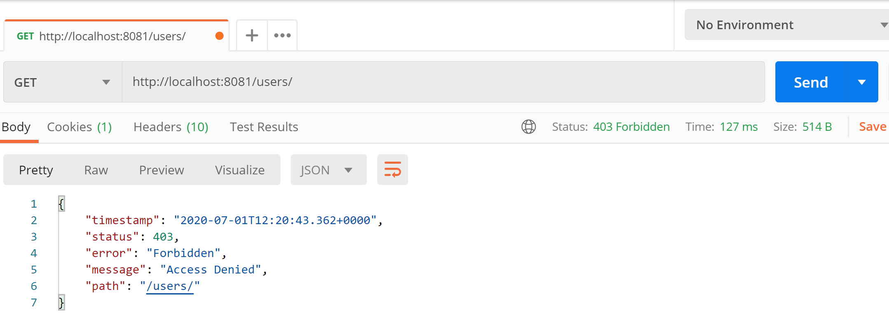
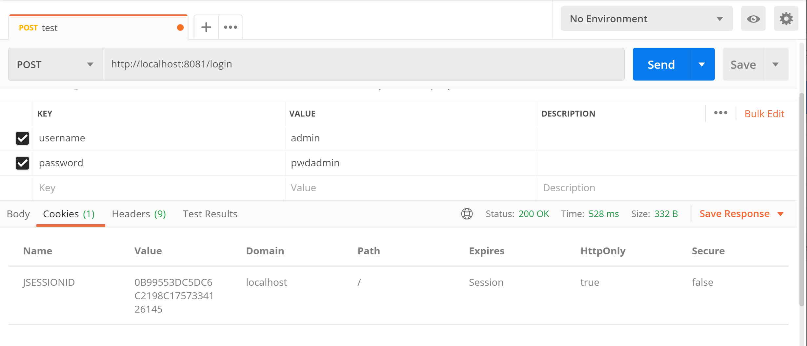
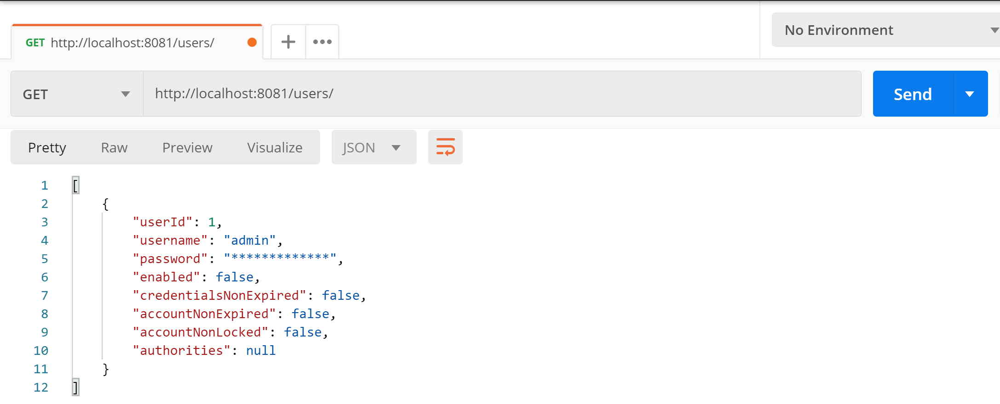
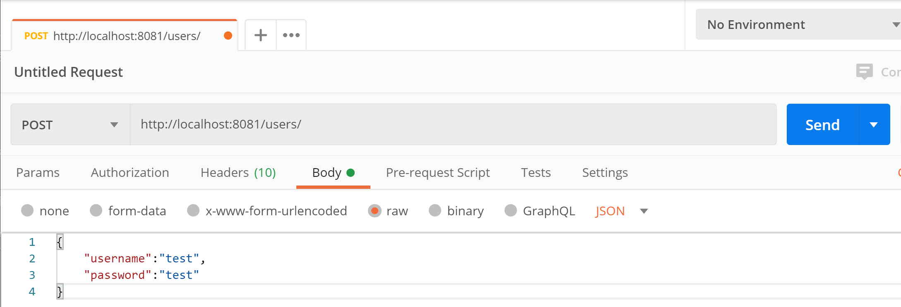
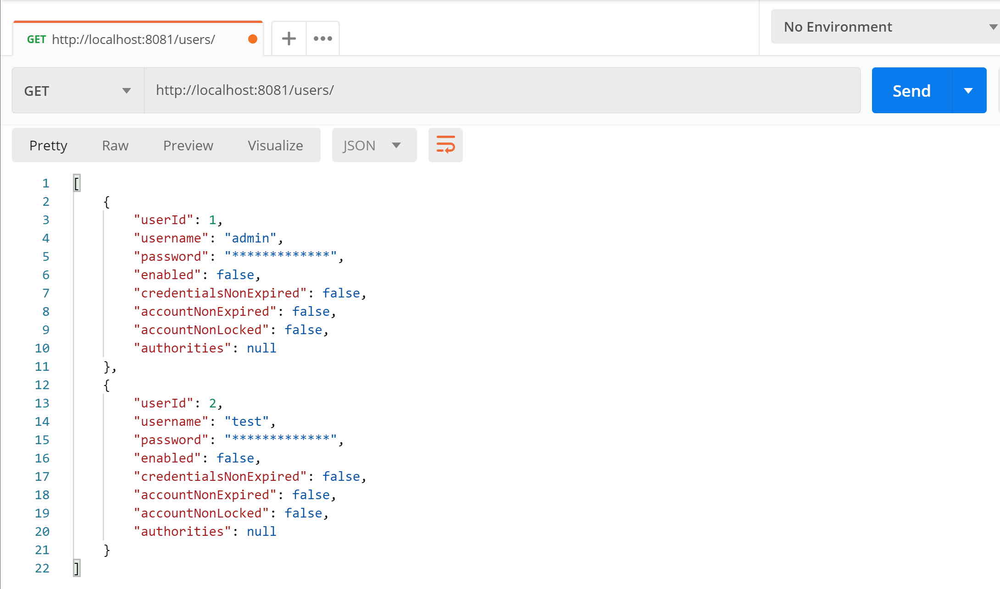

# Gestion des utilisateurs

Dans cette section nous allons créer la gestion des utilisateurs,
l'enregistrement et la récupération de ces derniers.
Dans un second temps, les passwords des utilisateurs seront hashés avec grain de sel en utilisant bcrypt.

## 1 gestion d'un utilisateur sans Hash du pwd
- Récupérer le code présent dans la [Step3](../step3/README.md)
- Créer le package ```com.security.app.user```
### 1.1 Modèle utilisateur
- Créer le package ```com.security.app.user.model```
- Déplacer ```User.java``` du package ```com.security.app.auth.model``` dans ```com.security.app.user.model``` (mettre à jour les références)
- Dans le package ```com.security.app.user.model``` créer le fichier ```UserDto.java``` comme suit. Cette classe sera utilisée pour récupérer les objets provenant du Web Browser.

```java
package com.security.app.user.model;

public class UserDto {
    private String username;
    private String password;
    private Integer role;

    public Integer getRole() {
        return role;
    }

    public void setRole(final Integer role) {
        this.role = role;
    }
    

    public String getUsername() {
		return username;
	}

	public void setUsername(String username) {
		this.username = username;
	}

	public String getPassword() {
        return password;
    }

    public void setPassword(final String password) {
        this.password = password;
    }

    @Override
    public String toString() {
        final StringBuilder builder = new StringBuilder();
        builder.append("UserDto [username=")
                .append(username)
                .append(", role=")
                .append(role).append("]");
        return builder.toString();
    }
}
```
### 1.2 Service utilisateur
Le service utilisateur va permettre d'appliquer la logique métier aux utilisateurs de notre application
- Créer le package ```com.security.app.user.controller```
- Créer le fichier ```UserService```  comme suit:

```java
package com.security.app.user.controller;

import ...

@Service
public class UserService {
	@Autowired
	UserRepository userRepository;
	
	@Autowired
	private PasswordEncoder passwordEncoder;
	
	public boolean addUser(UserDto userDto) {
		Optional<User> u =userRepository.findUserByUsername(userDto.getUsername());
		if( !u.isPresent()){
			User u_new=new User();
			u_new.setUsername(userDto.getUsername());
			u_new.setPassword(passwordEncoder.encode(userDto.getPassword()));
			userRepository.save(u_new);
			return true;
		}
		return false;
	}
	
	public boolean setUser(UserDto userDto, String username) {
		Optional<User> uOpt =userRepository.findUserByUsername(username);
		if( uOpt.isPresent()){
			User u=uOpt.get();
			u.setUsername(userDto.getUsername());
			u.setPassword(passwordEncoder.encode(userDto.getPassword()));
			userRepository.save(u);
			return true;
		}
		return false;
	}
	
	public boolean delUser(String username) {
		Optional<User> u =userRepository.findUserByUsername(username);
		if( u.isPresent()){
			userRepository.delete(u.get());
			return true;
		}
		return false;
	}
	
	public User getUser(String username) {
		Optional<User> u =userRepository.findUserByUsername(username);
		if( u.isPresent()){
			return u.get();
		}
		return null;
	}
	
	public User getUserNoPwd(String username) {
		Optional<User> uOpt =userRepository.findUserByUsername(username);
		if( uOpt.isPresent()){
			User u=uOpt.get();
			u.setPassword("*************");
			return u;
		}
		return null;
	}

	public List<User> getAllUserNoPwd() {
		List<User> userList = new ArrayList<>();
		userRepository.findAll().forEach(s -> {
			s.setPassword("*************");
			userList.add(s);
		});
		return userList;
	}
}

```
- Explications:
  - `u_new.setPassword(passwordEncoder.encode(userDto.getPassword()));` : permet de créer un password via un password encoder que nous allons mettre en place par la suite.

### 1.3 Rest Controller
Le Rest Controller va permettre de définir les URLs afin d'interagir avec les objets utilisateurs de l'application.
- Créer le package ```com.security.app.user.rest```
- Créer le fichier ```UserRestCrt``` comme suit:

```java
package com.security.app.user.rest;

import java.util.List;

import ...

@RestController
@RequestMapping("/users")
public class UserRestCrt {
	@Autowired
	UserService uService;
	
	@RequestMapping(method=RequestMethod.POST,value="/")
	public boolean addUser(@RequestBody UserDto userDto) {
		return uService.addUser(userDto);
	}
	
	@RequestMapping(method=RequestMethod.GET,value="/{username}")
	public User getUser(@PathVariable String username) {
		return uService.getUserNoPwd(username);
	}
	
	@RequestMapping(method=RequestMethod.PUT,value="/{username}")
	public boolean getUser(@PathVariable String username, @RequestBody UserDto userDto) {
		return uService.setUser(userDto,username);
	}
	
	@RequestMapping(method=RequestMethod.DELETE,value="/{username}")
	public boolean delUser(@PathVariable String username) {
		return uService.delUser(username);
	}
	
	@RequestMapping(method=RequestMethod.GET,value="/")
	public List<User> getAllUser() {
		return uService.getAllUserNoPwd();
	}
}

```

### 1.4 Mise à jour des règles de filtrage
Afin que le management des utilisateurs ne soient pas accessibles directement, nous allons mettre à jour les règles de sécurité.

- Modifier le fichier ```SecurityConfig.java``` comme suit: 

```java
...
    .authorizeHttpRequests(auth->auth
				.requestMatchers( "/hero/**").authenticated()
				.anyRequest().authenticated());


...
```

### 1.5 Test
- Démarrer votre serveur et essayer d'afficher directement la liste des utilisateurs:



- L'authentification n'étant pas réalisée l'url n'est pas accessible. La mise à jour des règles de sécurité a fonctionné

- Loggez vous en tant qu'admin et essayer à nouveau





- La liste des utilisateurs est affichée

- Créer un utilisateur de afficher à nouveau la liste des utilisateurs
  




## 2 Enregistrement d'un utilisateur avec password hashé + grain de sel
Dans cette section nous allons modifier notre application afin de stocker les mots de passe utilisateurs hashés avec un grain de sel.
Le choix de l'algorithme portera sur ```bcrypt``` comme discuté [ici](https://www.baeldung.com/java-password-hashing).
```bcrypt``` va permettre de hasher et ajouter un grain de sel automatiquement au password. Pour la vérification de la correspondance, le serveur va déduire le grain de sel du mot de passe stocké dans la base de données et l'appliquer (ainsi que la fonction de hash) au mot de passe transmit par le Web Browser.

### 2.1 Ajout d'un password Encoder
Nous allons utiliser un utilitaire de Springboot Security qui permet d'utiliser l'algorithme ```bcrypt```.

- Dans le package `com.security.app.config`, créer le fichier `MyBCryptPasswordEncoder` comme suit:

```java
package com.security.app.config.security;

import org.springframework.context.annotation.Bean;
import org.springframework.context.annotation.Configuration;
import org.springframework.security.crypto.bcrypt.BCryptPasswordEncoder;
import org.springframework.security.crypto.password.PasswordEncoder;

@Configuration
public class MyBCryptPasswordEncoder {
	
	@Bean	
	public PasswordEncoder passwordEncoder() {
		return new BCryptPasswordEncoder();
	}
}
```

- Explication
   - `@Bean`: définit que la fonction `passwordEncoder` sera gérée par le serveur Springboot et pourra être injectée dans d'autres classes.
   - Définition du password encoder que nous allons utiliser. Ce dernier fait partie des passwordEncoder disponibles par défaut sur Springboot Security (ici ```bcryp```).
  

- Modifier le fichier ```SecurityConfig.java``` dans le package ```com.security.app.config.security ``` comme suit:

```java
package com.security.app.config.security;

import ...
@Configuration
@EnableWebSecurity
public class SecurityConfig {
	@Autowired
	AuthService authService;
	
	@Autowired
	private PasswordEncoder passwordEncoder;

	@Bean
	AuthenticationManager authenticationManager(AuthenticationConfiguration authConfiguration) throws Exception {
		return authConfiguration.getAuthenticationManager();
	}

	@Bean
	public SecurityFilterChain filterChain(HttpSecurity http) throws Exception {
		http.csrf(csrf->csrf.disable());
		http
				.authenticationProvider(getProvider())
				//avoid redirection to login page
				.exceptionHandling(ex ->ex.authenticationEntryPoint(new Http403ForbiddenEntryPoint()))
				.formLogin(flogin->flogin
						.loginProcessingUrl("/login")
						.successHandler(successHandler())
						.failureHandler(failureHandler())
						.permitAll())
				.logout(lout->lout
					.logoutUrl("/logout")
					.permitAll()
					.invalidateHttpSession(true))
				.authorizeHttpRequests(auth->auth
				.requestMatchers( "/hero/**").authenticated()
				.anyRequest().authenticated());
		return http.build();
	}

	@Bean
	public AuthenticationProvider getProvider() {
		AppAuthProvider provider = new AppAuthProvider(authService);
		provider.setPasswordEncoder(passwordEncoder);
		return provider;
	}

	//Use to redefine return in case of good or bad auth
	private AuthenticationFailureHandler failureHandler() {
		return new SimpleUrlAuthenticationFailureHandler() {
			public void onAuthenticationFailure(HttpServletRequest request,
												HttpServletResponse response, AuthenticationException exception)
					throws IOException, ServletException {
				response.setContentType("text/html;charset=UTF-8");
				response.sendError(HttpServletResponse.SC_UNAUTHORIZED, "Authentication Failed. Wrong username or password or both");
			}
		};
	}


	private AuthenticationSuccessHandler successHandler() {
		return new SimpleUrlAuthenticationSuccessHandler() {
			public void onAuthenticationSuccess(HttpServletRequest request,
												HttpServletResponse response, Authentication authentication)
					throws IOException, ServletException {
				response.setContentType("text/html;charset=UTF-8");
				response.getWriter().println("LoginSuccessful");
			}
		};
	}

}
```
- Explication
   
   ```java
    ...
    @Autowired
	private PasswordEncoder passwordEncoder;
    ...
   ```
   - Nous allons injecter le passwordEncoder généré par le bean du fichier `MyBCryptPasswordEncoder`

   ```java
   ...
    @Bean
	public AuthenticationProvider getProvider() {
		AppAuthProvider provider = new AppAuthProvider(authService);
		provider.setPasswordEncoder(passwordEncoder);
		return provider;
	}
    ...
   ```
   - ```provider.setPasswordEncoder(passwordEncoder);```: permet de rattacher notre passwordEncoder à notre AuthentificationProvider custom.


### 2.2 Modification sur comportement de notre AuthenticationProvider
Afin d'utiliser le nouveau password encoder créé, le comportement de notre AuthenticationProvider doit être mis à jour.
- Dans le package ```com.security.app.auth.controller``` modifier le fichier ```AppAuthProvider.java``` comme suit: 

```java
...
UserDetails user = this.getUserDetailsService().loadUserByUsername(name);
        if (user == null) {
            throw new BadCredentialsException("Username/Password does not match for " + auth.getPrincipal());
            
        }else if(!this.getPasswordEncoder().matches(password, user.getPassword())) {
        	   throw new BadCredentialsException("Username/Password does not match for " + auth.getPrincipal());
        }
        return new UsernamePasswordAuthenticationToken(user, null, user.getAuthorities());
    }
...
```
- Explication
  - ```this.getPasswordEncoder().matches(password, user.getPassword())```: après avoir récupéré le passwordEncoder courant (```this.getPasswordEncoder()```), nous allons utiliser la commande de ```BCryptPasswordEncoder``` permettant de comparer le password transmit par le Web Browser avec le password hashé + grain de sel (```bcrypt```) de la base de données.

### 2.3 Test de connexion et d'enregistrement
Les mots de passe seront maintenant considérés comme hashés et avec un grain de sel par l'algorithm bcrypt dans la base de données.
- Modification du fichier ```data.sql``` de ```src.main.resources``` comme suit:

```sql
...
INSERT INTO APPUSER(username, password) VALUES('admin', '$2a$10$dq/6L9dKOq1O.Tlmm16tdeNJ0VBH6cfWE2I6MbRIHX2EQZsRV39f.')
...
```
- Explication:
    - ```$2a$10$dq/6L9dKOq1O.Tlmm16tdeNJ0VBH6cfWE2I6MbRIHX2EQZsRV39f.``` correspond au mot de passe ```pwdadmin``` hashé + grain de sel à l'aide de l'algorithm ```bcrypt```.


- Démarrer l'applicaiton et tester la connexion à l'aide du l'utilisateur ```username:admin, pwd:pwdadmin```


- l'utilisateur par défaut est bien loggé au système.

ATTENTION: dans cette configuration seul le mot de passe enregistré dans la base de données est hashé avec un grain de sel. Lors de la phase d'authentification le mot de est en clair! --> Besoin de mettre en place https pour un chiffrement de bout en bout
