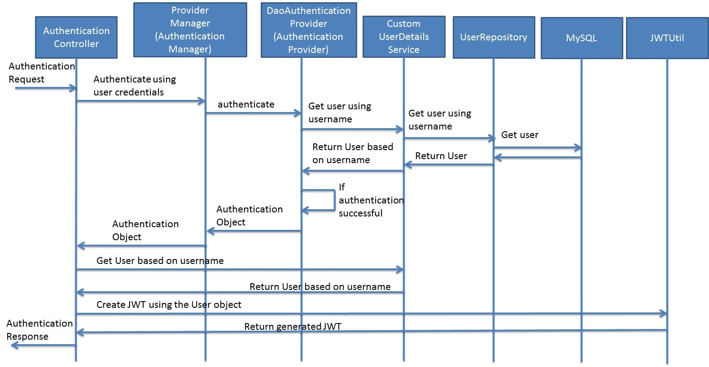
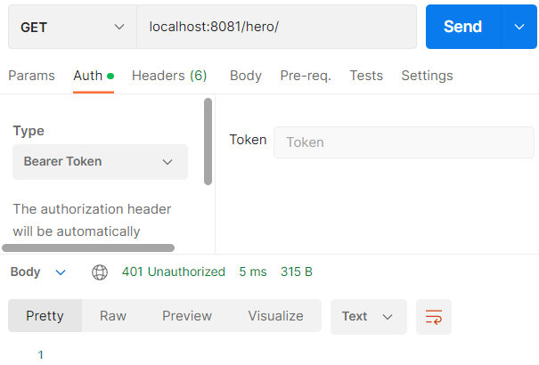
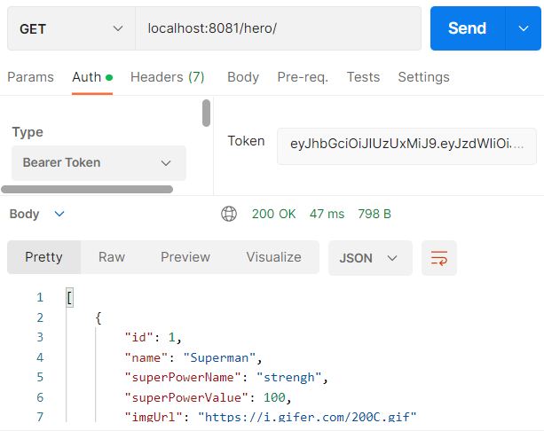

# Mise en place de token JWT 

## 1 Context
Afin de mettre en place une authentification compatible FullRest (stateless), les tokens d'authentification générés par le serveur Web seront des token signés numériquement. 
JWT, Json  Web Token, est un format de token relatif à la proposition de standard [RFC 7519](https://tools.ietf.org/html/rfc7519) visant, notamment, à uniformiser la gestion d'authentification via token pour les applications FullRest.

Ce tutoriel se base sur l'excellent [post de Dejan Milosevic](https://www.toptal.com/java/rest-security-with-jwt-spring-security-and-java) qui détaille l'intérêt des JWT ainsi que sa mise en oeuvre en Springboot, ainsi que le [post DZone basé sur le travail de Rida Shaikh ](https://dzone.com/articles/spring-boot-security-json-web-tokenjwt-hello-world).


Le schéma suivant présente le workflow qui va être mise en oeuvre pour l'authentification et la génération des tokens cf [Dzone](https://dzone.com/articles/spring-boot-security-json-web-tokenjwt-hello-world).



Le schéma suivant présente le workflow qui va être mise en oeuvre de la vérification du token cf [Dzone](https://dzone.com/articles/spring-boot-security-json-web-tokenjwt-hello-world).


Dans notre cas d'application les modifications suivantes seront apportées au workflow présenté ci-dessus:
- ``` Authentication Manager ``` --> ```AppAuthProvider```
- ``` JwtUserDetailsService``` --> ```AuthService```
- ``` HelloWorldController``` --> ```HeroRestCrt```


## 2 Socle de départ
- Repartez du projet réaliser en [Step4](../step4/README.md)

- Afin d'utiliser correctement les JWTs, nous aurons besoin d'une dépendance supplémentaire à ajouter au ```pom.xml``` de notre projet. Modifier le pom.xml de votre projet comme suit:

```xml
...
    <dependencies>
        ...
	<!-- Add dependency to JWT -->
		<dependency>
			<groupId>io.jsonwebtoken</groupId>
			<artifactId>jjwt</artifactId>
			<version>0.12.6</version>
		</dependency>
	</dependencies>
...
```


## 3 Rest Controller d'authentification

### 3.1 JwtAuthRestController
- Afin de permettre une génération de token en cas d'authentification réussie, le comportement de notre application doit être défini lors de l'appel de l'url ```/login```.
- Dans le package ```com.security.app.auth.controller```, créer le fichier ```JwtAuthRestController``` comme suit:

```java
package com.security.app.auth.controller;

import ...

@RestController
@CrossOrigin
public class JwtAuthRestController {

	@Autowired
	private AuthenticationManager authenticationManager;

	@Autowired
	private JwtTokenUtil jwtTokenUtil;

	@Autowired
	AuthService authService;

	@RequestMapping(value = "/login", method = RequestMethod.POST)
	public ResponseEntity<?> createAuthenticationToken(@RequestBody JwtRequest authenticationRequest) throws Exception {
		authenticate(authenticationRequest.getUsername(), authenticationRequest.getPassword());
		final UserDetails userDetails = authService.loadUserByUsername(authenticationRequest.getUsername());
		final String token = jwtTokenUtil.generateToken(userDetails);
		return ResponseEntity.ok(new JwtResponse(token));
	}

	private void authenticate(String username, String password) throws Exception {
		try {
			authenticationManager.authenticate(new UsernamePasswordAuthenticationToken(username, password));
		} catch (DisabledException e) {
			throw new Exception("USER_DISABLED", e);
		} catch (BadCredentialsException e) {
			throw new Exception("INVALID_CREDENTIALS", e);
		}

	}

}
```

- Explications
  ```java 
    ...
    @Autowired
	private AuthenticationManager authenticationManager;
    ...
  ``` 
  - Récupération de l'outil de gestion d'authentification de notre application. (AuthentificationManager sera exposé en tant que Bean dans le ```SecurityConfig``` comme vu ci-après)

  ```java 
    ...
	@Autowired
	private JwtTokenUtil jwtTokenUtil;
    ...
  ``` 
  - Injection d'utilitaires pour la manipulation des JWT (créé ci-après)

  ```java 
    ...
    @Autowired
	AuthService authService;    
    ...
  ``` 
  - Injection de notre service d'authentification créé dans les steps précédentes

  ```java 
    ...
    @RequestMapping(value = "/login", method = RequestMethod.POST)
	public ResponseEntity<?> createAuthenticationToken(@RequestBody JwtRequest authenticationRequest) throws Exception {   
    ...
    }
  ``` 
  - Définition d'un point d'entrée permettant la récupération du username et du password de l'utilisateur. ```JwtRequest``` est un simple object java jouant le rôle de DTO pour username et password.
  - 
  ```java 
    ...
        authenticate(authenticationRequest.getUsername(), authenticationRequest.getPassword()); 
    ...
  ``` 
  - Vérification de l'authentification. En cas d'échec retourne une exception

  ```java 
    ...
        final UserDetails userDetails = authService.loadUserByUsername(authenticationRequest.getUsername());
		final String token = jwtTokenUtil.generateToken(userDetails);
		return ResponseEntity.ok(new JwtResponse(token));
    ...
  ``` 
  - En cas de succès de l'authentification, les informations de l'utilisateur sont récupérées via ```authService``` et vont permettre de générer un token JWT à l'aide de la boite à outils ```jwtTokenUtil```. Ce token est ensuite retourné au Web Browser à l'aide d'un DTO de réponse ```JwtResponse```


  ```java 
    ...
      private void authenticate(String username, String password) throws Exception {
		try {
			authenticationManager.authenticate(new UsernamePasswordAuthenticationToken(username, password));
		} catch (DisabledException e) {
			throw new Exception("USER_DISABLED", e);
		} catch (BadCredentialsException e) {
			throw new Exception("INVALID_CREDENTIALS", e);
		}
    ...
  ``` 
    - Ici nous allons faire appel au gestionnaire d'authentification injecté (qui fait référence à notre AppAuthProvider créé dans les steps précédentes) pour vérifier les credentials passés en paramètre.

### 3.2 JwtTokenUtil
- Créer le package ```com.security.app.auth.tools```
- Dans ce package créé le fichier utilitaire comme suit:

```java
package com.security.app.auth.tools;
import ...

@Component
public class JwtTokenUtil implements Serializable {
	private static final long serialVersionUID = -2550185165626007488L;
	public static final long JWT_TOKEN_VALIDITY = 5 * 60 * 60;
	
	@Value("${jwt.secret}")
	private String secret;
	
    //retrieve username from jwt token
	public String getUsernameFromToken(String token) {
		return getClaimFromToken(token, Claims::getSubject);
	}

    //retrieve expiration date from jwt token
	public Date getExpirationDateFromToken(String token) {
		return getClaimFromToken(token, Claims::getExpiration);
	}

	public <T> T getClaimFromToken(String token, Function<Claims, T> claimsResolver) {
		final Claims claims = getAllClaimsFromToken(token);
		return claimsResolver.apply(claims);
	}

	// for retrieveing any information from token we will need the secret key
	private Claims getAllClaimsFromToken(String token) {
		return Jwts.parser().setSigningKey(secret).build().parseSignedClaims(token).getPayload();
	}

    //check if the token has expired
	private Boolean isTokenExpired(String token) {
		final Date expiration = getExpirationDateFromToken(token);
		return expiration.before(new Date());
	}

    //generate token for user
	public String generateToken(UserDetails userDetails) {
		Map<String, Object> claims = new HashMap<>();
		return doGenerateToken(claims, userDetails.getUsername());
	}

    //while creating the token -
    //1. Define  claims of the token, like Issuer, Expiration, Subject, and the ID
    //2. Sign the JWT using the HS512 algorithm and secret key.
    //3. According to JWS Compact Serialization(https://tools.ietf.org/html/draft-ietf-jose-json-web-signature-41#section-3.1)
    //   compaction of the JWT to a URL-safe string 
	private String doGenerateToken(Map<String, Object> claims, String subject) {
		return Jwts.builder()
					.claims(claims)
					.subject(subject)
					.issuedAt(new Date(System.currentTimeMillis()))
					.expiration(new Date(System.currentTimeMillis() + JWT_TOKEN_VALIDITY * 1000))
					.signWith(SignatureAlgorithm.HS512, secret).compact();
	}

    //validate token
	public Boolean validateToken(String token, UserDetails userDetails) {
		final String username = getUsernameFromToken(token);
		return (username.equals(userDetails.getUsername()) && !isTokenExpired(token));
	}
}

```

- Explications:
  ```java 
    ...
        @Component
        public class JwtTokenUtil implements Serializable {
    ...
  ``` 
  - ```@Component``` permet de créer un Bean et de l'exposé aux autres composants de notre application (permet l'injection via ```@Autowired``` dans les autres composants)

  ```java 
    ...
        @Value("${jwt.secret}")
	    private String secret;
    ...
  ```  
  - Permet de récupérer dans le fichier de configuration ```application.properties``` la valeur de la variable ```jwt.secret```

- Modifier le fichier ```application.properties``` dans ```src.main.resources ``` comme suit:

```yaml
...
 # JWT secret for token signature
jwt.secret=thisIsJwtServerSecretthisIsJwtServerSecretthisIsJwtServerSecretthisIsJwtServerSecretthisIsJwtServerSecret
...

```

### 3.3 Création de DTO
- Créer le package ```com.security.app.auth.model```
- Créer les fichiers ```JwtRequest.java``` et ```JwtResponse.java``` respectivement comme suit:
```java
package com.security.app.auth.model;
import java.io.Serializable;

public class JwtRequest implements Serializable {
    private static final long serialVersionUID = 5926468583005150707L;
    private String username;
    private String password;

    //need default constructor for JSON Parsing
    public JwtRequest()
    { }

    public JwtRequest(String username, String password) {
        this.setUsername(username);
        this.setPassword(password);
    }

    public String getUsername() {
        return this.username;
    }

    public void setUsername(String username) {
        this.username = username;
    }

    public String getPassword() {
        return this.password;
    }

    public void setPassword(String password) {
        this.password = password;
    }

}

```


```java
package com.security.app.auth.model;
import java.io.Serializable;

public class JwtResponse implements Serializable {

	private static final long serialVersionUID = -8091879091924046844L;
	private final String jwttoken;

	public JwtResponse(String jwttoken) {
		this.jwttoken = jwttoken;
	}

	public String getToken() {
		return this.jwttoken;
	}
}

```


## 4 Vérification du token lors de chaque réception de requêtes
- Lors de chaque appel de l'API de notre application, les requêtes devront contenir un token valide pour accéder à la ressource cible. Afin de vérifier la validité du token de chaque requête la classe ci-dessous devra être déclenchée à chaque fois.
- Créer dans le package ```com.security.app.auth.controller``` le fichier ```JwtRequestFilter.java``` comme suit:

```java
package com.security.app.auth.controller;

import ...

@Component
public class JwtRequestFilter extends OncePerRequestFilter {

	@Autowired
	AuthService authService;

	@Autowired
	private JwtTokenUtil jwtTokenUtil;

	@Override
	protected void doFilterInternal(HttpServletRequest request, HttpServletResponse response, FilterChain chain)
			throws ServletException, IOException {
		final String requestTokenHeader = request.getHeader("Authorization");
		String username = null;
		String jwtToken = null;

		// JWT Token is in the form "Bearer token". Remove Bearer word and get
		// only the Token

		if (requestTokenHeader != null && requestTokenHeader.startsWith("Bearer ")) {
			jwtToken = requestTokenHeader.substring(7);
			try {
				username = jwtTokenUtil.getUsernameFromToken(jwtToken);
			} catch (IllegalArgumentException e) {
				System.out.println("Unable to get JWT Token");
				System.out.println("JWT Token has expired");
			} catch (SignatureException e){
				System.out.println("JWT signature does not match");
			}
		} else {
			logger.warn("JWT Token does not begin with Bearer String");
		}

        // Once we get the token validate it.
		if (username != null && SecurityContextHolder.getContext().getAuthentication() == null) {
			UserDetails userDetails = this.authService.loadUserByUsername(username);
            // if token is valid configure Spring Security to manually set
            // authentication
			if (jwtTokenUtil.validateToken(jwtToken, userDetails)) {
				UsernamePasswordAuthenticationToken usernamePasswordAuthenticationToken = new UsernamePasswordAuthenticationToken(
						userDetails, null, userDetails.getAuthorities());
				usernamePasswordAuthenticationToken

						.setDetails(new WebAuthenticationDetailsSource().buildDetails(request));
                // After setting the Authentication in the context, we specify
                // that the current user is authenticated. So it passes the
                // Spring Security Configurations successfully.
				SecurityContextHolder.getContext().setAuthentication(usernamePasswordAuthenticationToken);
			}
		}
		chain.doFilter(request, response);
	}
}
```

- Explications:
  ```java 
    ...
        @Component
        public class JwtRequestFilter extends OncePerRequestFilter {
    ...
  ``` 
  - ```@Component``` permet de créer un Bean et de l'exposé aux autres composants de notre application (permet l'injection via ```@Autowired``` dans les autres composants)
  - ```OncePerRequestFilter``` l'héritage de cet objet permet de spécifier à springboot que ce filtre devra être exécuté à chaque requête http reçue.

```java 
    ...
        SecurityContextHolder.getContext().setAuthentication(usernamePasswordAuthenticationToken);
    ...
  ``` 
  - Une fois que le token aura été récupéré et validé, Springboot sera notifé que la requête courante est considérée comme authentifiée.


## 5 Modification de la configuration de sécurité de Springboot
- Afin de prendre en considération les éléments mis en place, la configuration de SpringBoot devra être modifiée comme suit.
- Dans le package ```com.security.app.config.security``` modifier le fichier ```SecurityConfig``` comme suit:

```java
	package com.security.app.config.security;
	import ...
	@Configuration
	@EnableWebSecurity
	public class SecurityConfig {
	    private final AuthService authService;
	    private final JwtAuthEntryPoint jwtAuthenticationEntryPoint;
		private final JwtRequestFilter jwtRequestFilter;
		private final PasswordEncoder passwordEncoder;
		public SecurityConfig( AuthService authService, 
								JwtAuthEntryPoint jwtAuthenticationEntryPoint,
								JwtRequestFilter jwtRequestFilter,
								PasswordEncoder passwordEncoder) {
			this.authService=authService;
			this.jwtAuthenticationEntryPoint=jwtAuthenticationEntryPoint;
			this.jwtRequestFilter=jwtRequestFilter;
			this.passwordEncoder=passwordEncoder;
		}

		// Security chain for JWT
		@Bean
		public SecurityFilterChain filterChain(HttpSecurity http) throws Exception {
			// use to allow direct login call without hidden value csfr (Cross Site Request
			// Forgery) needed
			http.csrf(csrf->csrf.disable());
			http.exceptionHandling(ex->ex
				.authenticationEntryPoint(jwtAuthenticationEntryPoint));
			http.sessionManagement(sess->sess
				.sessionCreationPolicy(SessionCreationPolicy.STATELESS));
			http.authenticationProvider(getProvider())
				.authorizeHttpRequests(
					auth-> auth
							.requestMatchers("/login").permitAll()
							.requestMatchers("/hero/**").authenticated()
							.anyRequest().authenticated());

			// Add a filter to validate the tokens with every request
			http.addFilterBefore(jwtRequestFilter, UsernamePasswordAuthenticationFilter.class);
			return http.build();
		}

			@Bean
			public AuthenticationProvider getProvider() {
				AppAuthProvider provider = new AppAuthProvider(authService);
				provider.setPasswordEncoder(passwordEncoder);
				return provider;
			}

			@Bean
			AuthenticationManager authenticationManager(AuthenticationConfiguration authConfiguration) throws Exception {
				return authConfiguration.getAuthenticationManager();
			}
	}

```
- Explications:
    ```java
    ...
    	http.csrf(csrf->csrf.disable());
			http.exceptionHandling(ex->ex
				.authenticationEntryPoint(jwtAuthenticationEntryPoint));
			http.sessionManagement(sess->sess
				.sessionCreationPolicy(SessionCreationPolicy.STATELESS))
    ...
    ```
    - ``` http.csrf(csrf->csrf.disable()); ``` permet de désactivé la sécurité csfr (Cross Site Request Forgery) permettant un appel direct du logi sans hidden value csfr
    - ```http.exceptionHandling(ex->ex.authenticationEntryPoint(jwtAuthenticationEntryPoint));``` redéfinition custom de l'exception en cas de mauvaise authentification. (classe ```jwtAuthenticationEntryPoint``` définie ci-après)
    - ```sessionCreationPolicy(SessionCreationPolicy.STATELESS);``` spécifie qu'aucune conservation d'état ne sera réalisée (compatibilité FullRest)
    - `http.addFilterBefore(jwtRequestFilter, UsernamePasswordAuthenticationFilter.class);` permet d'ajouter notre JWTFilter avant le `UsernamePasswordAuthenticationFilter`. Ce dernier sera en charge de vérifier le token transmis le cas échéant.


- Dans le `com.security.app.auth.controller` ajouter la classe suivante `JwtAuthEntryPoint.java` comme suit:

```java
package com.security.app.auth.controller;

import ...

@Component

public class JwtAuthEntryPoint implements AuthenticationEntryPoint, Serializable {
	private static final long serialVersionUID = -7858869558953243875L;

	@Override
	public void commence(HttpServletRequest request, HttpServletResponse response,
			AuthenticationException authException) throws IOException {
		response.sendError(HttpServletResponse.SC_UNAUTHORIZED, "Unauthorized");

	}
```
- Cette classe permet de définir le comportement de l'application en cas de mauvaise identification (redirection vers page de login, ou envoie d'un code d'erreur particulier)


## 6 Tester votre application
- Compiler et démarre votre application
- A l'aide de Postman accéder à l'URL suivante `http://localhost:8081/hero`. une error `401` devrait vous être retournée



- Nous devenons transmettre un token valide à notre application pour avoir accès à cette URL.
- A l'aide de PostMan loggez-vous à l'application comme suit:


- Avec les bons credentials une JWT token vous sera retourné dans le body de la réponse Http.
- Essayer à nouveau de vous connecter à l'URL `http://localhost:8081/hero`. Cette fois-ci nous allons ajouter le token dans le header `Authorization` de la requête. Dans Postman, sélectionner, `Auth` puis `Type -> Bearer Token` et copider la valeur du token dans le champ prévu à cet effet.
- Lancer votre requête cette fois ci vous pouver accéder correctement à votre URL.
 
