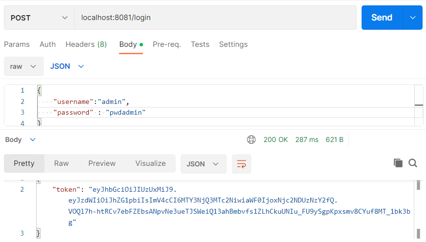
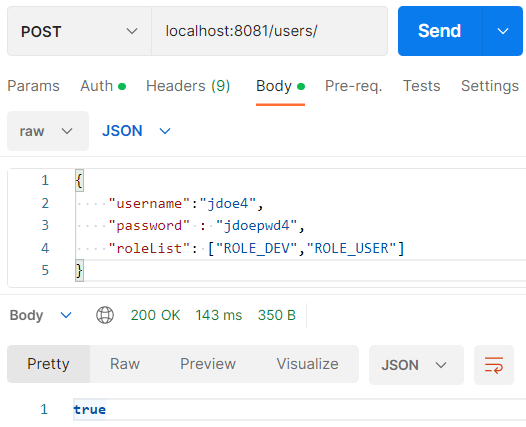
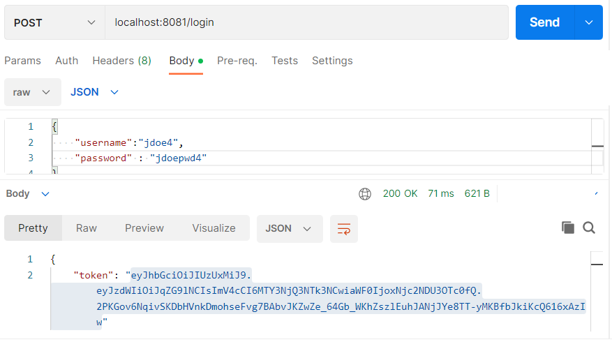
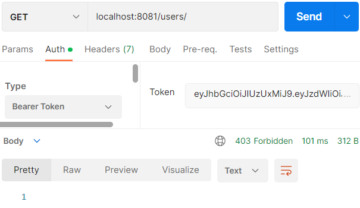

#  Mise en place d'autorisation et de roles

Dans cette section nous allons ajouter en plus des autorisations différentes pour accéder à des URL.
- Dans une premier temps allons repartir sur le contenu de la `step5`.

# 1 Ajout de Role

- Dans le package `com.security.app.user.model` ajouter le fichier `Role.java` comme suit:

```java

@Entity
@Table(name = "role")
public class Role {
    @Id
    @GeneratedValue(strategy =GenerationType.SEQUENCE,generator = "role_generator")
    @SequenceGenerator(name = "role_generator", initialValue = 3)
    @Column(name = "id")
    private int id;

    public Role(){
    }

    public Role(String s){
        this.roleName=s;
    }

    @Column(name = "role_name")
    private String roleName;

    // Getter and Setter
    ...
}
```

- Explications 
    ```java
    ...
         @GeneratedValue(strategy =GenerationType.SEQUENCE,generator = "role_generator")
         @SequenceGenerator(name = "role_generator", initialValue = 3)
    ...

    ```
        - Modification de la génération automatique d'ID afin de commencer à 3 (cela nous permettra d'ajouter des Roles depuis le fichier data.sql)


# 2 Modification de User
- Modifier le fichier `User.java` dans le package `com.security.app.user.model` comme suit:

    ```java
    @Entity
    @Table(name = "APPUSER")

    public class User implements Serializable , UserDetails {
        @Id
        @GeneratedValue(strategy =GenerationType.SEQUENCE,generator = "user_generator")
        @SequenceGenerator(name = "user_generator", initialValue = 3)
        private Integer userId;
        private String username;
        private String password;

        @OneToMany(fetch = FetchType.EAGER, cascade = CascadeType.ALL)
        @JoinTable(name = "USER_ROLE",
                joinColumns = {@JoinColumn(name = "USER_ID")},
                inverseJoinColumns = {@JoinColumn(name = "ROLE_ID")})
        private List<Role> roleList;


        @Override
        public Collection<? extends GrantedAuthority> getAuthorities() {
            List<SimpleGrantedAuthority> roleListAuthorities= new ArrayList<>();
            for(Role r: roleList){
                roleListAuthorities.add(new SimpleGrantedAuthority(r.getRoleName()));
            }
            return roleListAuthorities;
       }
        // Getter and Setter
    ```
    - Explications:
        ```java
            ...
            @Id
            @GeneratedValue(strategy =GenerationType.SEQUENCE,generator = "user_generator")
            @SequenceGenerator(name = "user_generator", initialValue = 3)
            private Integer userId;
            ...
        ```
        - Modification de la génération automatique d'ID afin de commencer à 3 (cela nous permettra d'ajouter des Roles depuis le fichier data.sql)
        
        ```java
            ...
            @OneToMany(fetch = FetchType.EAGER, cascade = CascadeType.ALL)
            @JoinTable(name = "USER_ROLE",
                joinColumns = {@JoinColumn(name = "USER_ID")},
                inverseJoinColumns = {@JoinColumn(name = "ROLE_ID")})
            private List<Role> roleList;
            ...
        ```
        - `@OneToMany` créer une relation 1-n entre la table `User` et la table `Role`
        - `fetch = FetchType.EAGER` permet de charger les valeurs relatives de la table `Role` lors de la récupération d'un `User`
        - `cascade = CascadeType.ALL` Applique les opérations à la table de jointure
        - `@JoinTable` : permet de redéfinir la table de jointure en User et Role (nom de la table , nom des attributs de jointure etc). Ceci nous sera utile pour préremplir le fichier `data.sql`
        
        ```java
            ...
             @Override
            public Collection<? extends GrantedAuthority> getAuthorities() {
                List<SimpleGrantedAuthority> roleListAuthorities= new ArrayList<>();
                for(Role r: roleList){
                    roleListAuthorities.add(new SimpleGrantedAuthority(r.getRoleName()));
                }
                return roleListAuthorities;
            }
            ...
        ```
        - Permet de transformer nos `Role` en `GrantedAuthority` utiliser par Spring Security pour vérifier les autorisations d'un utilisateur

    - Nous allons également mettre à jour le `UserDto` afin qu'il supporte l'ajout de `Role`.
    - Dans le package `com.security.app.user.model` modifier le fichier `UserDTO.java` comme suit:
    
    ```java
        public class UserDto {
            private String username;
            private String password;

            private List<String> roleList;

            public void setRoleList(List<String> roleList) {
                this.roleList = roleList;
            }   

            public List<String> getRoleList() {
                return roleList;
            }
        //GETTER and SETTER

    ```

    - Modifier maintenant le `UserService` pour prendre en compte ces ajouts:

    ```java
        @Service
        public class UserService {
        	@Autowired
        	UserRepository userRepository;

        	@Autowired
        	private PasswordEncoder passwordEncoder;

        	public boolean addUser(UserDto userDto) {
        		Optional<User> u =userRepository.findUserByUsername(userDto.getUsername());
        		if( !u.isPresent()){
        			User u_new=new User();
        			u_new.setUsername(userDto.getUsername());
        			u_new.setPassword(passwordEncoder.encode(userDto.getPassword()));

        			List<Role> authorities=new ArrayList<>();
        			userDto.getRoleList().forEach (e -> authorities.add(new Role(e)));
        			u_new.setRoleList(authorities);

        			userRepository.save(u_new);
        			return true;
        		}
        		return false;
        	}

        	public boolean setUser(UserDto userDto, String username) {
        		Optional<User> uOpt =userRepository.findUserByUsername(username);
        		if( uOpt.isPresent()){
        			User u=uOpt.get();
        			u.setUsername(userDto.getUsername());
        			u.setPassword(passwordEncoder.encode(userDto.getPassword()));

        			List<Role> authorities=new ArrayList<>();
        			userDto.getRoleList().forEach (e -> authorities.add(new Role(e)));
        			u.setRoleList(authorities);

        			userRepository.save(u);
        			return true;
        		}
        		return false;
        	}
            ...

    ```
    - Explications:
        ```java
        ...
            List<Role> authorities=new ArrayList<>();
        			userDto.getRoleList().forEach (e -> authorities.add(new Role(e)));
        			u_new.setRoleList(authorities);

        			userRepository.save(u_new);
        ...
        ```
        - `userDto.getRoleList().forEach (e -> authorities.add(new Role(e)));` : ici nous transformons les Role du format String en Role.
        -  `userRepository.save(u_new);` :l e user est ensuite ajouter à la DB avec ces nouveaux éléments

# 3 Modification de la configuration de Sécurité
- Dans le package `com.security.app.config.security` modifier le fichier `SecurityConfig.java` comme suit:

    ```java
        @Configuration
        @EnableWebSecurity
        public class SecurityConfig {
            ...

        	
        	@Bean
        	public SecurityFilterChain filterChain(HttpSecurity http) throws Exception {
        		http.csrf(csrf->csrf.disable());
		        http.exceptionHandling(ex->ex
				    .authenticationEntryPoint(jwtAuthenticationEntryPoint));
		        http.sessionManagement(sess->sess
				    .sessionCreationPolicy(SessionCreationPolicy.STATELESS));
		        http.authenticationProvider(getProvider())
				    .authorizeHttpRequests(
						auth-> auth
							.requestMatchers("/login").permitAll()
							.requestMatchers("/hero/**").hasAnyAuthority("ROLE_USER","ROLE_ADMIN")
							.requestMatchers("/users/**").hasAuthority("ROLE_ADMIN")
							.anyRequest().authenticated());

        		http.addFilterBefore(jwtRequestFilter, UsernamePasswordAuthenticationFilter.class);
        		return http.build();
        	}
        ...
    ```

    - Explications:
      - `.requestMatchers("/users/**").hasAuthority("ROLE_ADMIN")` : Pour accéder à l'ensemble d'URL `/users/**` l'utilisateur devra avoir les Role (Authority) `ROLE_ADMIN`
      - `.requestMatchers("/hero/**").hasAnyAuthority("ROLE_USER","ROLE_ADMIN")` Pour accéder à l'ensemble d'URL `/users/**` l'utilisateur devra avoir l'un des Role(Authority) précisés  `ROLE_ADMIN` ou  `ROLE_USER`
      - Aucune autre action est nécessaire. Lorsque l'utilisateur est authentifié, le userDetail de ce dernier est conserver dans le SecurityContext, c'est en appelant la méthode `getAuthorities()` que Spring security vérifiera les autorisations nécessaires


# 4 Test de l'application
- Nous allons modifier le fichier `data.sql` afin de définir un utilisateur par défaut possédant les droites `ROLE_ADMIN`.
- Dans le package `|main.resources` modifier le fichier `data.sql` comme suit:

```sql
    -- Add default Roles
    INSERT INTO ROLE(id,role_name) VALUES(1,'ROLE_ADMIN');
    INSERT INTO ROLE(id,role_name) VALUES(2,'ROLE_USER');

    -- Add default User
    INSERT INTO APPUSER(user_id,username, password) VALUES(1,'admin', '$2a$10$dq/6L9dKOq1O.Tlmm16tdeNJ0VBH6cfWE2I6MbRIHX2EQZsRV39f.');

    -- Add default User - Role Association
    INSERT INTO USER_ROLE(USER_id,ROLE_id) VALUES(1,1);
    INSERT INTO USER_ROLE(USER_id,ROLE_id) VALUES(1,2);

    INSERT INTO HERO(name, super_power_name,super_power_value, img_url) VALUES('Superman', 'strengh',100, 'https://i.gifer.com/200C.gif');
    INSERT INTO HERO(name, super_power_name,super_power_value, img_url) VALUES('Falsh', 'speed',50, 'https://i.gifer.com/UJgv.gif');
    INSERT INTO HERO(name, super_power_name,super_power_value, img_url) VALUES('Batman', 'technology',30, 'https://i.gifer.com/KfU.gif');
    INSERT INTO HERO(name, super_power_name,super_power_value, img_url) VALUES('Thor', 'storm',100, 'https://i.gifer.com/D2Tc.gif');
```

- Compiler et démarrer votre application
- A l'aide de PostMan loggez-vous à l'application 
 


- A l'aide de PostMan créer un nouvel utilisateur avec le tokent admin
  
  

- Avec le token admin assurer vous que vous avez bien accès à l'URL `http://localhost:8081/hero`.
  


- Maintenant logguez-vous avec l'utilisateur que vous venez de créer



- Avec ce nouveau token vérifier que vous avez également accès à l'URL `http://localhost:8081/hero`.


- Avec ce nouveau token vérifier que vous n'avez plus accès également accès à l'URL `http://localhost:8081/users` --> `Forbidden Code 403`.




  
  